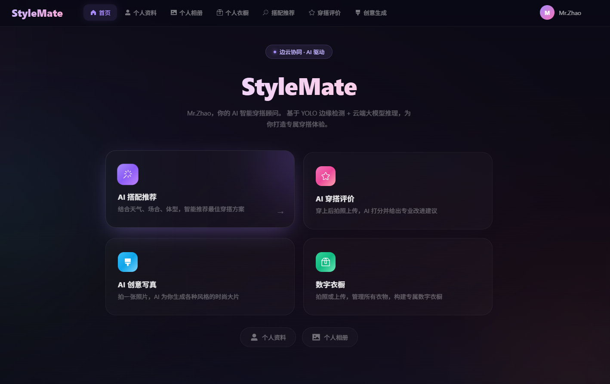
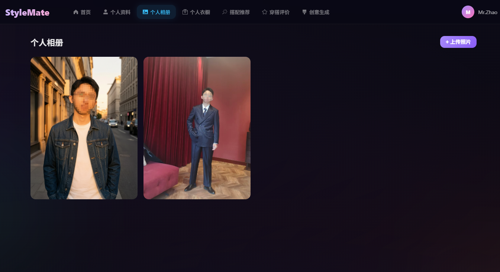
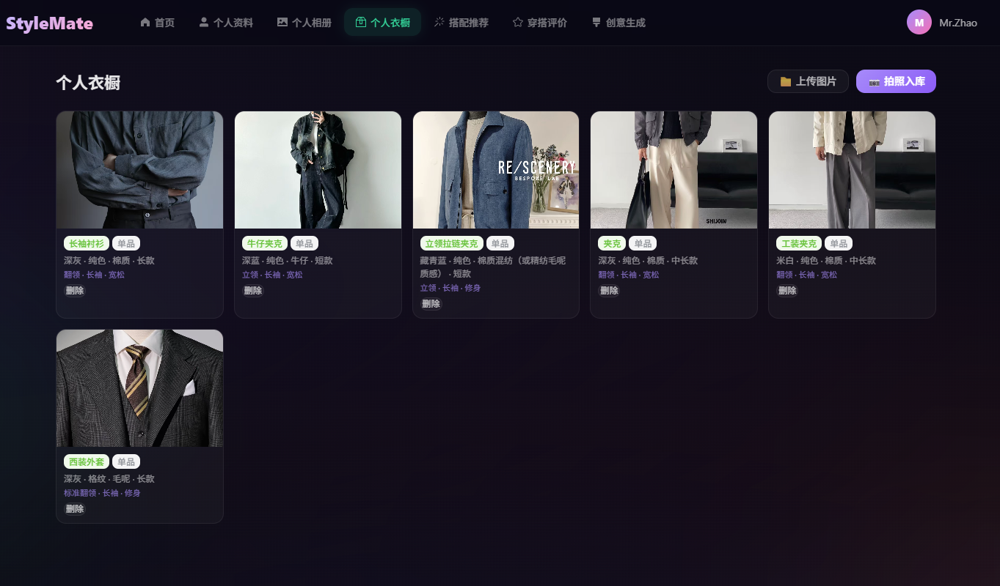
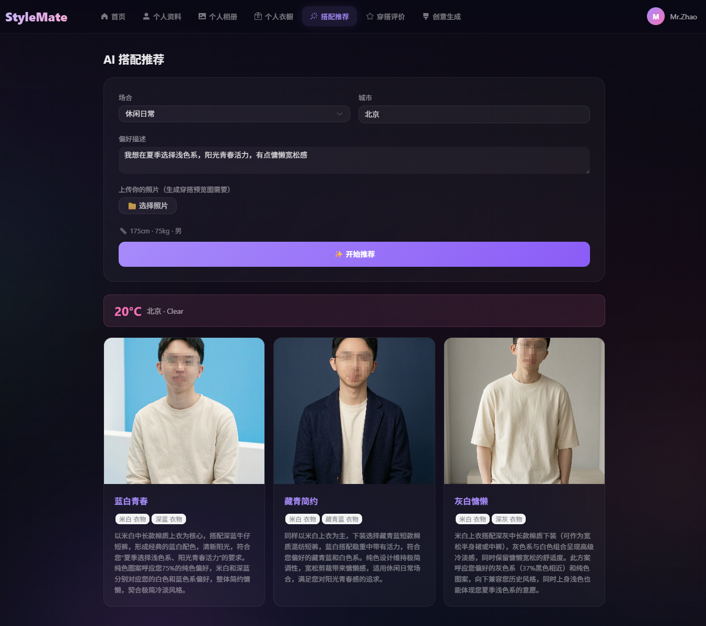
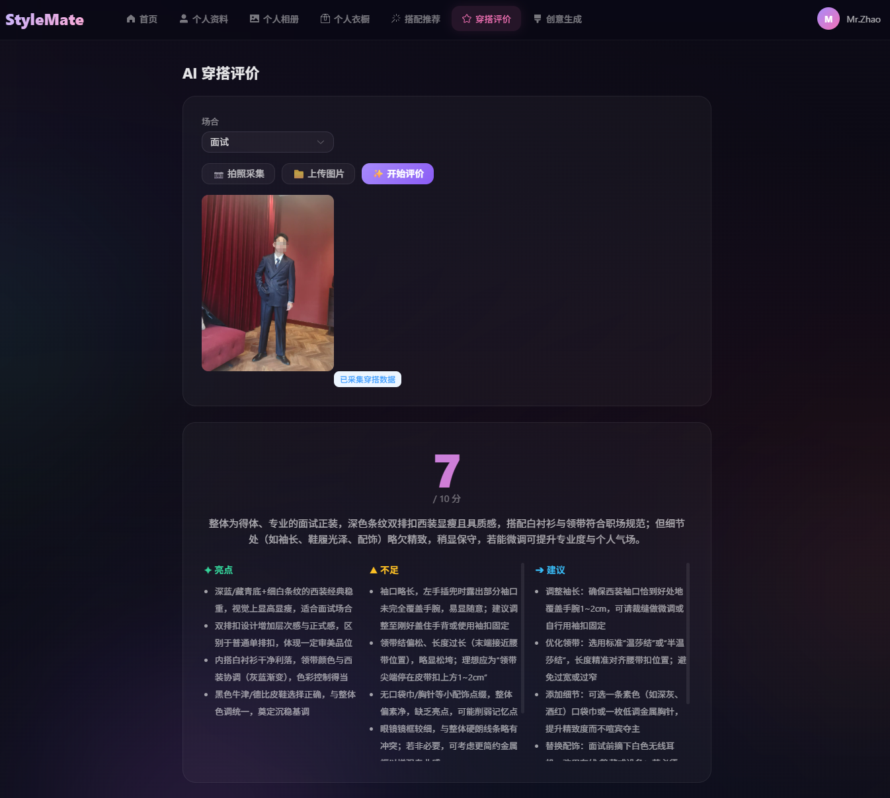
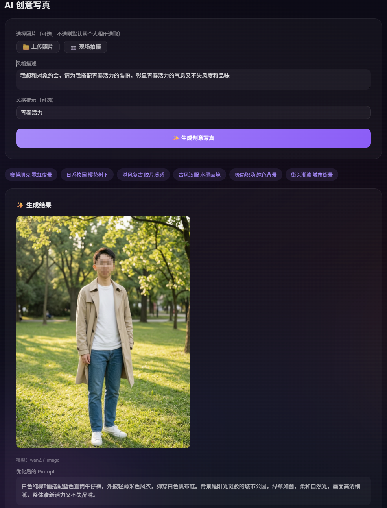

<p align="center">
  <br>
  <h1 align="center">StyleMate</h1>
  <p align="center">边云协同 · AI 穿搭助手</p>
</p>

<p align="center">
  <a href="#-功能一览"><strong>功能</strong></a> ·
  <a href="#-快速开始"><strong>快速开始</strong></a> ·
  <a href="#-技术架构"><strong>架构</strong></a> ·
  <a href="#-项目结构"><strong>目录</strong></a> ·
  <a href="#-截图"><strong>截图</strong></a>
</p>

---

## ✨ 一句话介绍

**您的专属 AI 穿搭顾问，拍照即分析，一键试穿预览。**

---

## 🎯 功能一览

| 功能 | 说明 |
|------|------|
| 📸 **个人相册** | 上传照片 → 边端 YOLO 识别人脸和衣物，自动打标签 |
| 👗 **个人衣橱** | 拍照入库 → YOLO 分析颜色/图案/面料 → **大模型看图校验**，精确到领型袖型 |
| 🧠 **风格画像** | 自动聚合历史数据，学习你的颜色偏好、穿搭风格，删数据自动清零 |
| ✨ **AI 搭配推荐** | 选场合 → DeepSeek 出 3 套方案 → **万相 2.7-Pro 生成上身试穿预览图**，三联可下载 |
| 🎨 **创意写真** | 上传照片 + 描述 → AI 保留人脸，换装换场景，下载到本地 |
| 📝 **AI 穿搭评价** | 拍照当前穿搭 → YOLO 参考 + **视觉模型看图打分**，亮点/不足/建议一目了然 |

---

## 🏗 技术架构

```
┌─────────────────┐      HTTP      ┌─────────────────┐      HTTP      ┌──────────────┐
│     前端 Vue3    │ ←────────────→ │   后端 FastAPI   │ ←───────────→ │  边端 YOLO   │
│  Element Plus   │               │  LangChain +     │               │  FastAPI     │
│  Pinia · Axios  │               │  SQLAlchemy      │               │  :9001       │
│  :5173          │               │  :9000           │               │              │
└─────────────────┘               └────────┬─────────┘               └──────────────┘
                                           │
                              ┌────────────┼────────────┐
                              │            │            │
                         DeepSeek      Qwen VL      万相 2.7
                        (文字推理)    (视觉理解)    (图像生成)
```

| 大模型 | 服务商 | 用途 |
|--------|--------|------|
| DeepSeek `deepseek-v4-flash` | deepseek.com | 搭配推荐、写真 prompt 优化 |
| 通义千问 `qwen3-vl-flash` | 阿里 DashScope | 穿搭视觉评价、衣橱云端校验 |
| 万相 2.7-Pro | 阿里 DashScope | 上身试穿预览、创意写真生成 |

详细架构见 [ARCHITECTURE.md](ARCHITECTURE.md)。

---

## 🚀 快速开始

### 1. 克隆项目
```bash
git clone https://github.com/MrZhao-hub666/StyleMate.git
cd StyleMate
```

### 2. 配置密钥

在 `backend/.env` 中填入：
```env
DEEPSEEK_API_KEY=你的DeepSeek密钥
DASHSCOPE_API_KEY=你的阿里DashScope密钥
```

### 3. 一键启动（两种方式）

#### 🖱 方式一：双击 bat（最简单）
```
双击 start-edge.bat     → 启动边端 YOLO (:9001)
双击 start-backend.bat  → 启动后端 API  (:9000)
cd frontend && npm run dev  → 启动前端  (:5173)
```
> 首次使用需先执行下方步骤 4 安装依赖。

#### ⌨ 方式二：命令行（推荐开发时）
```bash
# 终端 1 — 边端
cd edge && uv run uvicorn server:app --host 0.0.0.0 --port 9001 --reload

# 终端 2 — 后端
cd backend && uv run uvicorn app.main:app --host 0.0.0.0 --port 9000 --reload

# 终端 3 — 前端
cd frontend && npm run dev
```

### 4. 首次安装依赖
```bash
cd edge && uv sync          # Python 依赖 + 自动下载 YOLO 模型
cd ../backend && uv sync     # Python 依赖
cd ../frontend && npm install # Node 依赖
```

浏览器打开 `http://localhost:5173`

> 💡 **提示**：边端 YOLO 默认使用 ultralytics 预训练权重做人体检测，衣物区域基于几何估算。如需更高精度，可用自己的衣物标注数据微调 YOLO，替换到 `edge/` 目录。

---

## 📁 项目结构

```
StyleMate/
├── backend/                 # 云端后端 (FastAPI :9000)
│   ├── app/
│   │   ├── api/             # 接口层 (portrait/recommend/review/wardrobe/...)
│   │   ├── agent/           # LLM Agent (搭配/评价/写真优化)
│   │   ├── services/        # 服务层 (生图/天气/风格画像/清理)
│   │   ├── models/          # SQLAlchemy 模型 (用户/衣橱/相册)
│   │   ├── knowledge/       # 知识库 (ChromaDB + 向量检索)
│   │   └── config.py        # 统一配置入口
│   └── .env                 # API 密钥（不入 git）
│
├── edge/                    # 边端 (FastAPI :9001)
│   ├── server.py            # HTTP 分析服务
│   ├── detector.py          # YOLO 人体 + 衣物区域检测
│   ├── attribute_pipeline.py # 七维属性解析管线
│   ├── classifier.py        # 区域→品类启发式映射
│   ├── color_analyzer.py    # K-means 颜色提取 + HSV 命名
│   ├── texture_analyzer.py  # Gabor + GLCM 图案面料分析
│   └── uploader.py          # 上传到云端接口
│
├── frontend/                # 前端 (Vue3 + Vite :5173)
│   └── src/
│       ├── views/           # 页面 (Home/Profile/Gallery/Wardrobe/Recommend/Review/Portrait)
│       ├── components/      # 组件 (CameraPanel)
│       ├── stores/          # Pinia 状态管理
│       ├── api/             # Axios 封装
│       └── router/          # 路由
│
├── start-backend.bat        # 一键启动后端
├── start-edge.bat           # 一键启动边端
├── ARCHITECTURE.md          # 详细架构文档
└── .gitignore
```

---

## 📸 界面截图

> 将你的实际截图放入 `docs/screenshots/` 目录，替换以下占位。

### 首页 & 个人资料

*左侧个人信息卡片，右侧功能入口*

### 个人相册

*上传照片 → 边端自动分析人脸和穿搭属性*

### 个人衣橱

*拍照入库 → YOLO 分析 → 大模型校验，颜色图案面料一目了然*

### AI 搭配推荐

*选场合 → 3 套文字方案 + 3 张上身试穿预览图，悬停即可下载*

### 创意写真

*上传照片 + 风格描述 → AI 换装换场景，保留人脸*

### AI 穿搭评价

*拍照当前穿搭 → AI 看图打分，亮点不足一目了然*

---

## ⚙️ 配置说明

所有模型和 API 配置集中在 `backend/app/config.py`：

| 变量 | 说明 | 默认值 |
|------|------|--------|
| `DEEPSEEK_MODEL` | 文本推理模型 | `deepseek-v4-flash` |
| `DASHSCOPE_VISION_MODEL` | 视觉理解模型 | `qwen3-vl-flash` |
| `DASHSCOPE_IMAGE_MODEL` | 图像生成模型 | `wan2.7-image` |
| `DASHSCOPE_IMAGE_MODEL_PRO` | 预览图生成模型 | `wan2.7-image-pro` |

所有模型名称均可通过修改配置文件一键切换，无硬编码。

---

## 🛡️ 数据说明

- 所有上传照片、生成图片存储在本地 `uploads/` 目录，不上传第三方
- 生成预览图 1 小时后自动清理；写真保存到相册后原图删除
- 删除衣橱/相册数据后，风格画像自动归零重建
- API 密钥存放在 `backend/.env`，已加入 `.gitignore`

---

## 📄 License

MIT
